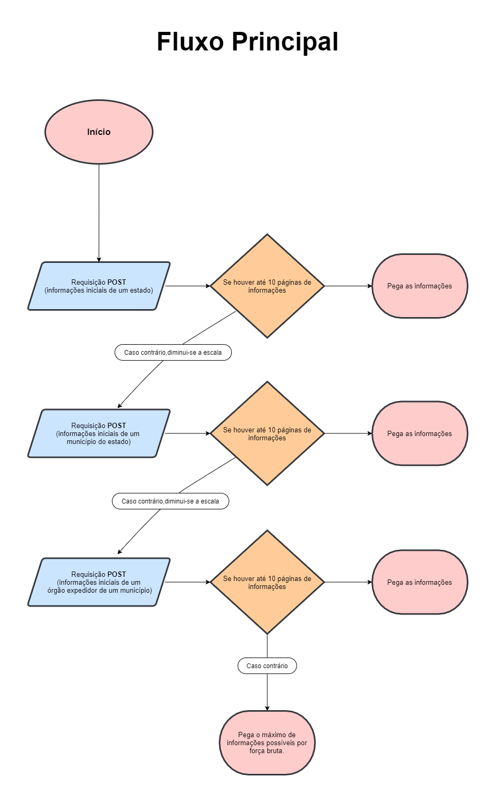

# BNMP Scraper
<!-- SUMÁRIO -->
<details open="open">
  <summary>Sumário</summary>
  <ol>
    <li>
      <a href="#instalação">Instalação</a>
      <ul>
        <li><a href="#como-obter-cookie">Como obter cookie</a></li>
      </ul>
    </li>
    <li>
      <a href="#exemplo-de-uso">Exemplo de uso</a>
      <ul>
        <li><a href="#criando-extrator">Criando extrator</a></li>
        <li><a href="#raspando-mandados">Raspando Mandados</a></li>
        <li><a href="#lendo-mandados-com-o-pandas">Lendo mandados com o Pandas</a></li>
      </ul>
    </li>
    <li>
      <a href="#sobre-o-projeto">Sobre o projeto</a>
      <ul>
        <li><a href="#motivação">Motivação</a></li>
        <li><a href="#objetivo">Objetivo</a></li>
        <li><a href="#como-funciona">Como nosso algoritmo funciona</a></li>
        <li><a href="#principais-desafios">Principais desafios</a></li>
        <li><a href="#melhores-insights">Melhores insights</a></li>
      </ul>
    </li>
  </ol>
</details>

<!-- INSTALAÇÃO -->
## Instalação
Para esse programa funcionar você precisa ter o Python instalado no seu computador. Baixe o Python [aqui](https://www.python.org/downloads/).
  ```
  pip install bnmp_scraper
  ```

<!-- COMO OBTER COOKIE -->
### Como obter cookie
  
Como o Portal BNMP requer que passemos por um captcha antes de acessar o site, para que esse programa funcione você precisa antes acessar o portal, passar pelo captcha e colar um cookie válido(e não expirado) em bnmp_scraper/settings.py seguindo o passo-a-passo abaixo.

  
1) Acesse https://portalbnmp.cnj.jus.br/#/pesquisa-peca e passe pelo captcha

2) Selecione um estado aleatório na aba "Pesquisar peças"

3) Entre no modo desenvolvedor do seu navegador(tecla F12) e vá até a aba Network do modo desenvolvedor

4) Com a aba Network aberta e o estado selecionado (como fizemos nas etapas anteriores), clique em pesquisar

5) Uma requisição com nome começando com "filter?" deve aparecer na aba Network, clique nessa requisição

6) Na aba Cabeçalho(ou "Headers") da requisição, encontre a opção "Cabeçalho da requisição"(ou "Request Headers")

7) Dentro do "Cabeçalho da requisição" procure por um valor chamado "cookie", clique com o botão direito e copie esse valor

8) Pronto, agora você pode usar esse cookie para instanciar nosso Extrator como no exemplo de uso abaixo :).

<!-- EXEMPLO DE USO -->
## **Exemplo de uso**

### Criando extrator
  ```
from bnmp_scraper import Extrator
extrator = Extrator("seu-cookie-aqui")
  ```

### Raspando Mandados
  ```
mandadosAcre = extrator.estado('AC')
mandadosAcre.baixar_mandados()
lista_mandados = mandadosAcre.obter_mandados()
  ```


### Lendo mandados com o Pandas
  ```
import pandas as pd
df = pd.json_normalize(mandadosAcre.obter_mandados())
  ```

<!-- SOBRE O PROJETO -->
## Sobre o projeto

<!-- MOTIVAÇÃO -->
### Motivação

Fomos motivados a fazer um trabalho de raspagem de dados do portal BNMP (Banco Nacional de Mandados de Prisão) por conta de uma série de matérias jornalísticas ligando esse portal a vazamentos de dados.

Na nossa análise, o site **parece** sim **ter melhorado quanto a exposição dos seus dados**, porém parece ter feito isso **restringindo o acesso à informação**

Por exemplo, apesar dos dados serem públicos, não é possível baixa-los completamente. O portal até disponibiliza uma opção para baixar os dados em CSV, mas o arquivo baixado tem um limite de 10.000 mandados (para estados com muitos mandados, isso é muito pouco) e mesmo os mandados baixados não trazem as informações completas.

<!-- OBJETIVO -->
### Objetivo

Nosso programa navega diretamente na API do Portal BNMP para coletar os mandados em sua totalidade, disponibilizando-os em uma pasta de arquivos jsons para qualquer um que queira analisar-los.


<!-- COMO FUNCIONA -->
## Como funciona

<p align="center">
    

<!-- PRINCIPAIS DESAFIOS -->
### Principais desafios

1. O banco de dados do portal possui um limite para o número máximo de mandados retornadas por requisição (2000 mandados por requisição do tipo POST)
2. O banco de dados do portal também limita o número máximo de páginas de mandados disponíveis para acesso por id (para requisições de 2000 mandados, o limite é de 5 páginas - o portal limita o acesso aos 10.000 primeiros mandados)

<!-- MELHORES INSIGHTS -->
### Melhores insights

1. Conseguimos acessar mais dados diminuindo a escala com que procuramos para que, consequentemente, haja menos mandados por id. Nós buscamos por 

    estado -> município -> órgão expedidor


2. Conseguimos aumentar o limite de páginas de informações que podem ser alcançadas de 5 para 10 páginas alterando a ordenação dos elementos(fazendo requisições com a ordenação ascendente e pegando as primeiras 5 páginas e depois descendente pegando também as primeiras 5 páginas)

3. Por fim, para órgãos expedidores com mais de 10 páginas de mandados nós desenvolvemos uma função que aproveita as mais diferentes formas de ordenação para, por força bruta, pegar o maior número de mandados possível daquele órgão.